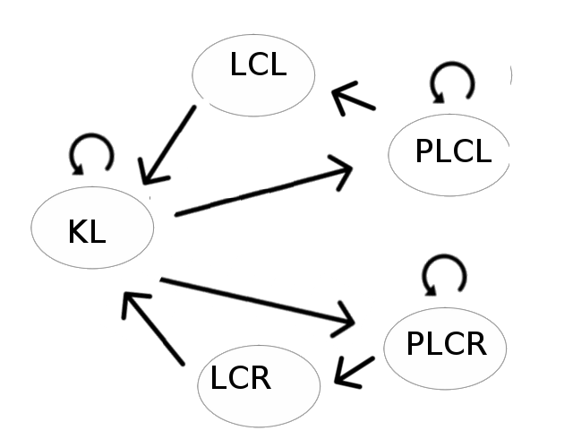

# **CarND-Path-Planning-Project** 
---

**Design a Path planner**

This is the seventh Project of the Self Driving Car Engineer NanoDegree by Udacity. In this project, the goal is to design a path planner that is able to create smooth and safe paths for the vehicle to follow a three-lane road with traffic. The designed path planner was implemented in C++, and was tested in a simulated circular track provided by Udacity.

The path planner has to meet the following requirements:
* The vehicle must be able to drive at least 4.32 miles without incident.
* The vehicle must be able to keep inside its lane.
* The vehicle has to  avoid colliding with other vehicles.
* The vehicle must drive according to the speed limit (50 MPH)
* Max Acceleration (10 m/s^2) and Jerk (10 m/s^3) are not exceeded.
* The vehicle must be able to change lanes if necessary (due to the behavior planing decision).

[//]: # (Image References)

The designed path planner must be able to meet the above requirements, using location, sensor fusion and map data.

## Submission Files
The following files are part of this project:
- src/main.cpp: main file that integrates the designed path planner with the simulator;.

- src/vehicle.cpp: vehicle class which defines the behaviour planning and trajectory generation.

- src/cost_function.cpp: cost function class to compute the optimal state.

## Path planner design
To the path planner design, I used the concepts of the course and the [Q & A video](https://www.youtube.com/watch?v=7sI3VHFPP0w). The vehicle speed is controlled  by increasing or decreasing it no more than 0.224 mph, tthis in order to meet the limits of acceleration and jerk. In my implementation, I do not implemented  cost functions too complex, instead, I  I decided to focus my cost functions mainly on comfort, safety and efficiency in speed, security above all.

The design of the code can be analyzed in general in four concepts: Behaviours (Finite State Machine), safety checks, trajectory generation and cost functions.

### Behaviours (Finite State Machine)
To control vehicle's behavior I used a Finite states machine with five possible states:

* KL (keep lane) - the ego vehicle must stay in the same lane. Depending on the safety checks, the ego vehicle can increase its speed (no vehicles too close in the same lane), adjust its speed in relation to the others vehicle's speed in the same lane or just drive with maximum speed. 
* PLCL (prepare lane change left) - the ego vehicle prepares to change to the left lane. In this state, the algorithm checks if the vehicle speed and the buffer space are safe to change lane. The vehicle may stay in the PLC_ state until the buffer is safe enough to change lane or even decide to return to the KL state if the calculation of the current costs informs this decision to the path planner.
* PLCR (prepare lane change right) - the same as PLCL but for the right turn. 
* LCL (lane change left). When there is enough buffer space to change lane, the vehicle will change to the left lane.
* LCR (lane change right). the same as LCL but for the right turn.
 
The core of this section of the code could be found in vehicle.cpp lines 56 – 88. The diagram of the FSM designed is in the next image:

### Safety Checks
Each time the next possible ego-vehicle's states are calculated, from the current state, for each state the algorith predicts the position of  the other vehicles in the target lane (of the particular state) (vehicle.cpp line 219, 243), and performs a safety check of the ego-vehicle's speed with respect to the predicted position of the other vehicles in the same lane (vehicle.cpp line 211 - 232) and in the final lane (PLCx / LCx states) (vehicle.cpp line 235 - 283). The next step is to update the vehicle speed with respect to the safety checks and the respective state.

### Cost Functions
The path planner calculates a pair lane-velocity for each possible (next) state of the vehicle, these two values ​​are used to calculate the total cost of each possible state and select the best state, that is, the state that produces least cost. For this, five cost functions were used:

**Target** (cost_function.cpp lines 31-39): this method evaluates the speed comparison between the ego vehicle and the vehicle in front (in the end lane of the state) and calculates a cost. This cost is proportional to the difference between these speeds, decreasing if the speed of the vehicle at the end lane is close to the speed of the ego vehicle.

**Change Lane** (cost_function.cpp lines 42-48): This cost function adds a "comfort" penalty if the ego vehicle decides to execute a lane change.

**Inefficiency** (cost_function.cpp lines 54-59): this method evaluates the speed of the vehicle in relation to the maximum speed allowed and calculates a cost. This cost is higher for states with lower speeds compared to the maximum speed allowed ("less efficient").

**Collision** (cost_function.cpp lines 61-77): this method calculates one of the most important costs, since it strongly penalizes the states in which the collision risk is more imminent. This cost is lower if it is safe to execute a lane change, however, this cost has the main priority, to avoid collisions during lane changes, observed in the initial tests of the designed path planner.

**Buffer** (cost_function.cpp lines 81-102): this method calculates a cost according to how long the ego vehicle is for the other vehicles in the lane. This cost is lower if the vehicle in question is behind of the ego vehicle. This helps the ego vehicle to choose a lane with no traffic in front.

## Trajectory generation
For the generation of a smooth trajectory, in this implementation we used the [spline library](https://kluge.in-chemnitz.de/opensource/spline/). This path contains some previous waypoints of the ego vehicle and some future points of the map. The core of the trajectory generation can be found in Main.cpp.

### Points to improve
Analyzing my implementation, I could observe some points:

- In my implementation I did not take into account information about the lane speeds. If the planner is given information on which is the fastest lane, the cost functions can be modified to improve the efficiency, over time, of the trip.

- The adjustment of the cost's weights is very important, in the initial tests of the designed path planner, in the initial tests of the designed path planner, it used to happen that the ego vehicle tended to change lanes even with the risk of colliding with other vehicles in the end lane. Because of this, much more importance has been given to the cost of the collision.

Video (Output):
A video of my implementation can be found in: ["video"](https://youtu.be/RZG2032DIBA).
